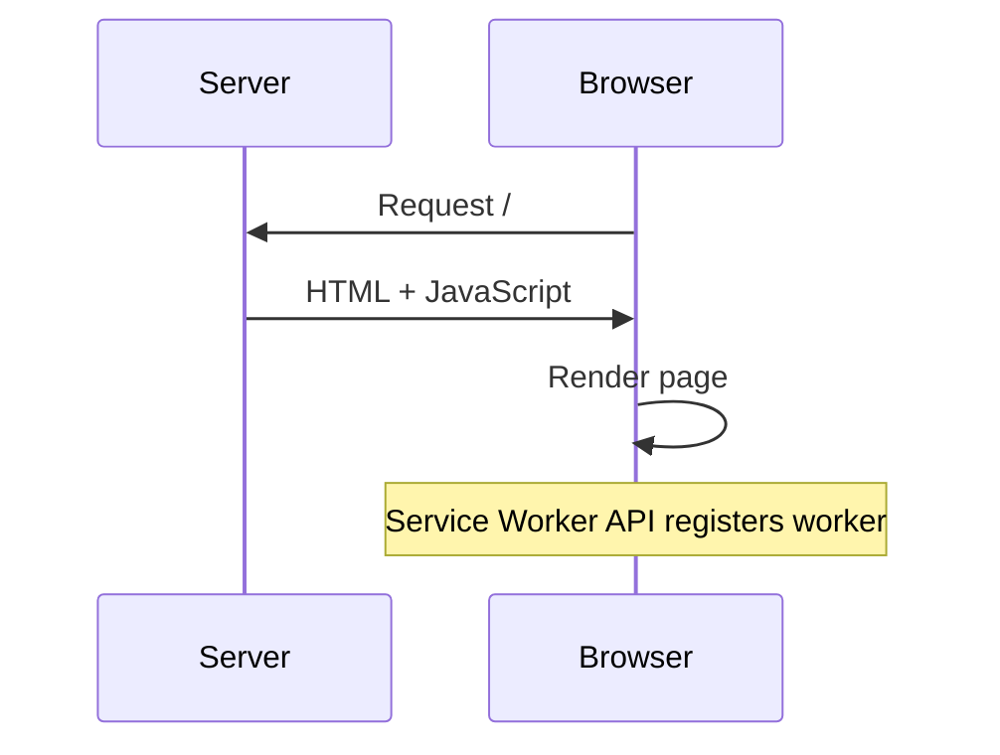
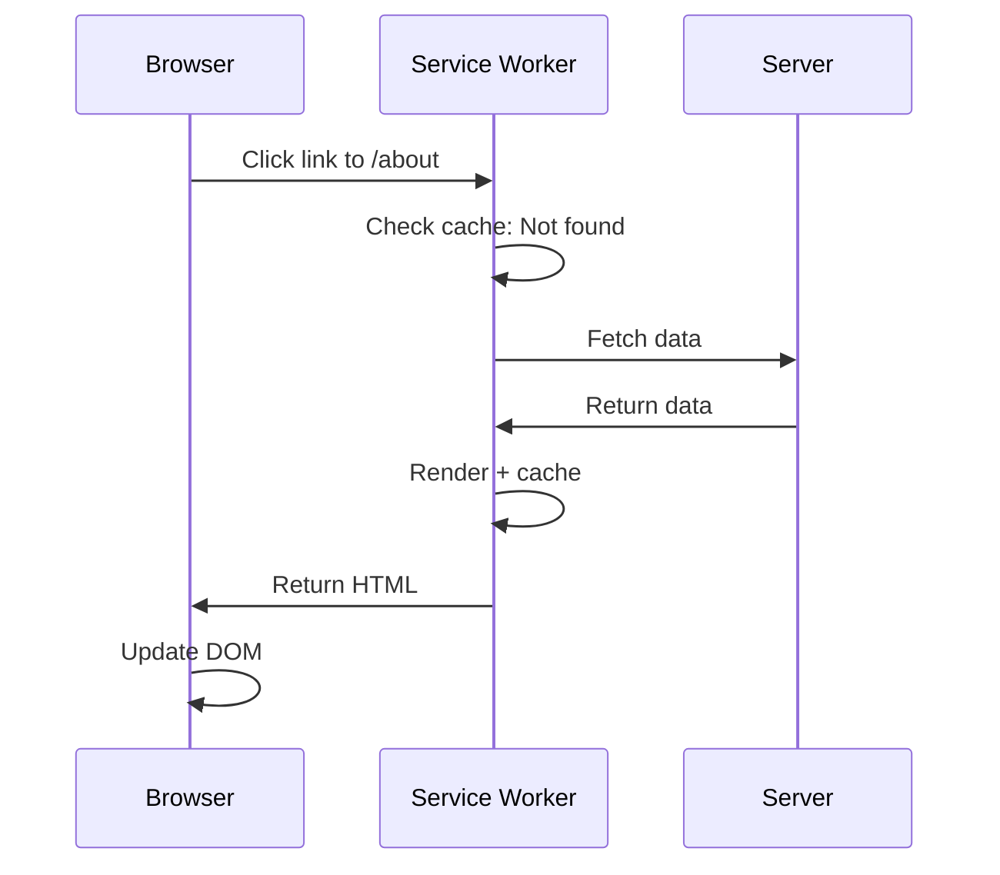
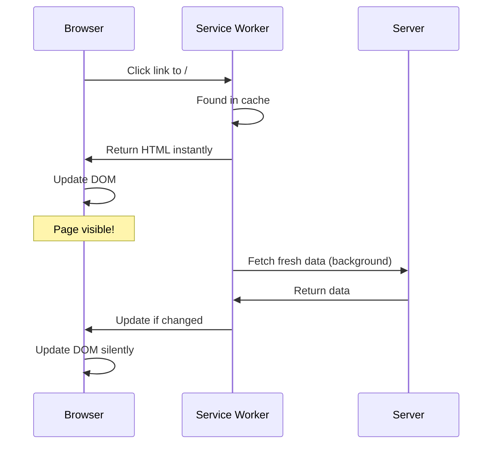

# WorkerRender

A framework that renders the same templates on both server and service worker.

## What is it?

WorkerRender lets you write HTML templates once and render them in two places. The server handles the first page load. After that, a service worker renders navigation with cached data for instant transitions.

**[View Live Demo →](https://aaronshaf.github.io/WorkerRender/)**

## Features

- **Write once, render anywhere.** Define your routes once and they work on both the server and in the service worker.
- **Instant navigation.** Page transitions are instant using smart DOM updates that preserve form state and scroll position.
- **Fast with caching.** The service worker caches content in IndexedDB for instant subsequent page loads.
- **Smart DOM diffing.** Uses Idiomorph to update only what changed, preserving input values and focus state.
- **Hono's JSX templates.** Uses Hono's JSX runtime for type-safe, universal HTML templates.

## Getting Started

New to WorkerRender? Start here:

1. **[Your First App](./tutorials/01-your-first-app.md)** - Build a simple app in 3 minutes
2. **[Adding Interactivity](./tutorials/02-adding-interactivity.md)** - Make your pages interactive
3. **[Custom Layouts](./tutorials/03-custom-layouts.md)** - Add CSS and customize your HTML

Want to understand how it works? Read [How It Works](./HOW_IT_WORKS.md).

## Example Code

Here's what a route looks like:

```tsx
import { defineRoute } from '@worker-render/core';

export const routes = [
  defineRoute({
    path: '/',
    async loader() {
      return { message: 'Hello World' };
    },
    Page({ data }) {
      return (
        <main>
          <h1>{data.message}</h1>
          <a href="/about">About</a>
        </main>
      );
    },
    title: () => 'Home'
  })
];
```

With our Vite plugin, the service worker and client code are **auto-generated**:

```ts
// vite.config.ts
import workerRender from '@worker-render/vite';

export default {
  plugins: [
    workerRender({
      routes: './src/app.routes.tsx',
      layout: './src/layout.ts'
      // That's it! No manual SW or client setup needed!
    })
  ]
};
```

## How Pages Load

### First Visit



Your server sends HTML, just like a normal website. The Service Worker API installs the service worker in the background.

### First Time Visiting a Route



The service worker intercepts navigation, fetches data from the server, and caches it for next time.

### Returning to a Cached Route



The service worker serves from cache instantly, then fetches fresh data in the background. If something changed, the page updates silently.

## Learn More

- **[Tutorials](./tutorials/)** - Step-by-step guides
- **[How It Works](./HOW_IT_WORKS.md)** - Architecture deep dive
- **[Example App](./examples/basic)** - Full example with Tailwind CSS

## License

MIT
